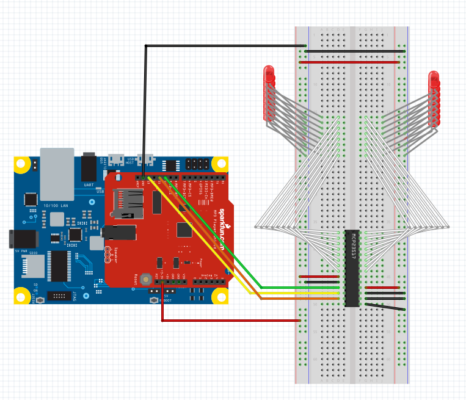

#Piano on Galileo

## Contents
- [Components](#components)
- [Hooking Up Components](#hooking-up-components)
- [Let's Run It](#let's-run-it!)
- [How The Code Is Broken Up](#how-the-code-is-broken-up)
- [Configuration Files](#configuration-files)
- [Tips](#tips)

---

### Components
- Intel Galileo Board
- Windows Image on microSD card
- [MP3 Player Shield](https://www.sparkfun.com/products/10628)
- 16-Bit I/O Expander with Serial Interface [We used this one](http://www.microchip.com/wwwproducts/Devices.aspx?dDocName=en023500)
- 16 LEDS

##### Optional Components
- Computer Keyboard
- micro-USB Male to USB Female

---

### Hooking up Components

1. Place the MP3 Player Shield on top of your galileo board with the pins lined up
1. Place the I/O Expander onto a breadboard and hook up its 8 GPA pins and 8 GPB pins to the 16 LEDs with the other end of the LEDs hooked to ground.[Look Here for MCP23S17 Specs](http://ww1.microchip.com/downloads/en/DeviceDoc/21952b.pdf)
1. Hook up A0, A1, and A2 on the I/O Expander to GROUND on your Galileo.
1. Hook up RESET on the I/O Expander to 3.3V on your Galileo.
1. Hook up Vdd on the I/O Expander to 3.3V on your Galileo.
1. Hook up Vss on the I/O Expander to GROUND on your Galileo.
1. Hook up NC on the I/O Expander to GP10 on your Galileo.
1. Hook up SCL on the I/O Expander to GP13 on your Galileo.
1. Hook up SDA on the I/O Expander to GP11 on your Galileo.

### Hooking up Optional Components
1. Plug the Computer Keyboard into the USB Female end of the converter.
1. Plug the micro-USB Male end of the converter into your Galileo Host USB port

---

### Let's Run It!
There are two ways to run the project

1. Using Telnet and your development computer to trigger keystrokes.
    * You can either remote deploy or move the Piano.exe directly onto your Galileo (either way make sure it's on your Galileo)
    * When in a telnet session connected to your Galileo, launch the Piano.exe (built from the project)
    * You should now see the light-up sequence if you have correctly connected everything
    * Now you should be able to play sounds using your keyboard input through telnet.
1. Using an external keyboard and running it without a computer connection
    * Make sure your Galileo has finished booting up and you have connected a keyboard to your Galileo's USB Host Port
    * You can either remote deploy or move the Piano.exe directly onto your Galileo (either way make sure it's on your Galileo)
    * (The next steps require a bit of blind typing)
    * Using the keyboard connected to the Galileo, type "cd c:\LocationToFile" and hit enter to go into the folder containing Piano.exe
    * Using the keyboard connected to the Galileo, type "Piano.exe" and hit enter to launch the program
    * You should now see the light-up sequence if you have correctly connected everything.
    * Now you should be able to play sounds using your keyboard input through telnet.
    
---

### How The Code is Broken Up
- Main.cpp
- KeyboardLightController.cpp and .h
- PianoLogic.cpp and .h
- SpiMidi.cpp and .h
- spi_missing.h
- stdafx.h

**_Main_**
- The main function that initializes the Galileo Pins to talk SPI to the Music Shield and reads input from the keyboard in order to trigger the sounds and lights

**_PianoLogic_**
- Houses all of the logic for the piano system such as keyUp, keyDown, Lighting, Playing a sound, reading the XML files, etc.

**_KeyboardLightController_**
- Houses all of the functionality to trigger the lighting through the GPIO port expander

**_spi_missing_**
- Creates a namespace that hosts the functions missing from spi.h such as begin, end, and transfer with options. 

**_SpiMidi_**
- Houses all of the MIDI commands through SPI in order to simplify calling code

**_stdafx_**
- Houses all of the external includes for the project

---

### Configuration Files
- KeyMap.xml
    - Xml that contains the mapping for a keyboard key to a MIDI note and the Light position
    - Also contains mapping of keyboard keys to special functions like AutoPlay
- Song.xml
    - The song to be auto-played
    - Each note in the song is composed of the keyboard key to be "pressed" and the how long it should be pressed (duration)
    - Since the key 'y' was not linked to a note, we used it here for a wait between notes

---

### Tips
1. You can edit the KeyMap.xml file to map any MIDI sounds to the keys on your keyboard